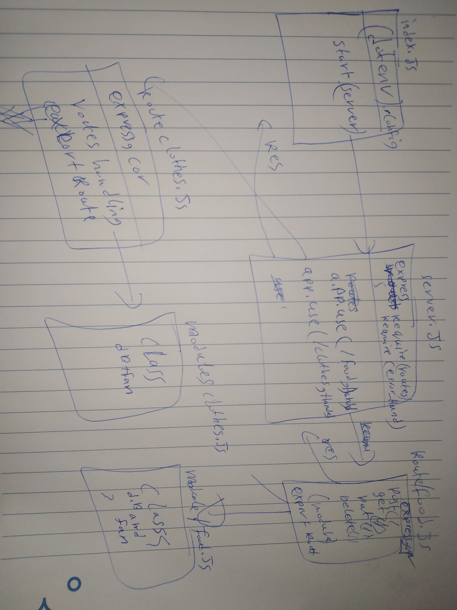

# LAB - 03

## Deployment Test

### Author: Mohammad Quthama

- [submission PR](# LAB - 02(basic-express-server

## Deployment Test

### Author: Mohammad Quthama

- [submission PR](https://github.com/mohammad-qethama/basic-api-server/pull/1)
- [tests report](https://github.com/mohammad-qethama/basic-api-server/actions)
- [master-deployment](https://api-food-clothes.herokuapp.com/)

### Setup

#### `.env` requirements

- `PORT` - 3000

#### Running the app

- `npm start`

- Endpoint: `/food`
 

```JavaScript

  app.use('/food',foodRoute);

```

- Endpoint: `/clothes`
 

```JavaScript

  app.use('/food',clothesRoute);

```


#### Tests

- Unit Tests: `npm run test`
  - test for logger.js
  - test for server.js

#### UML



